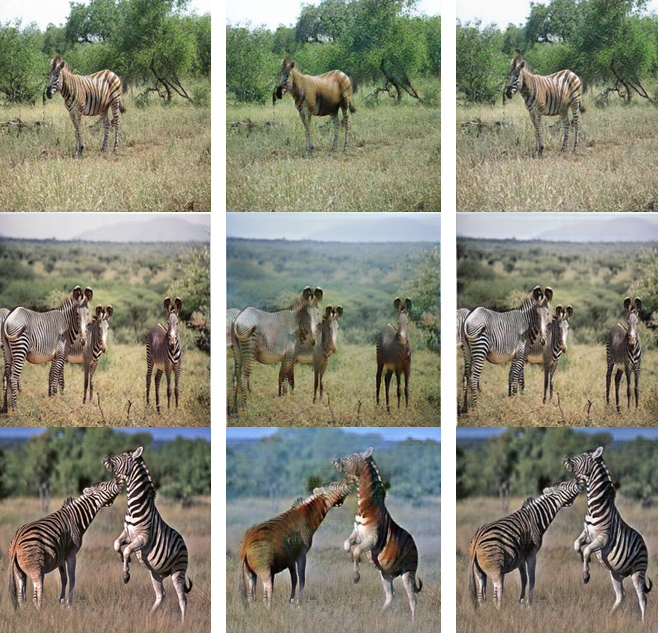

An implementation of CycleGAN in Pytorch from the Aladdin Persson YouTube channel.

Note: I barely understood this project; it was not the best jumping off point for learning Pytorch.

To use the train.py file, you must download the data from kaggle: [https://www.kaggle.com/datasets/suyashdamle/cyclegan](https://www.kaggle.com/datasets/suyashdamle/cyclegan)

## Sample Results

|1st column: Input / 2nd column: Generated / 3rd row: Re-converted|
|:---:|
||
||
# cycle-gan
